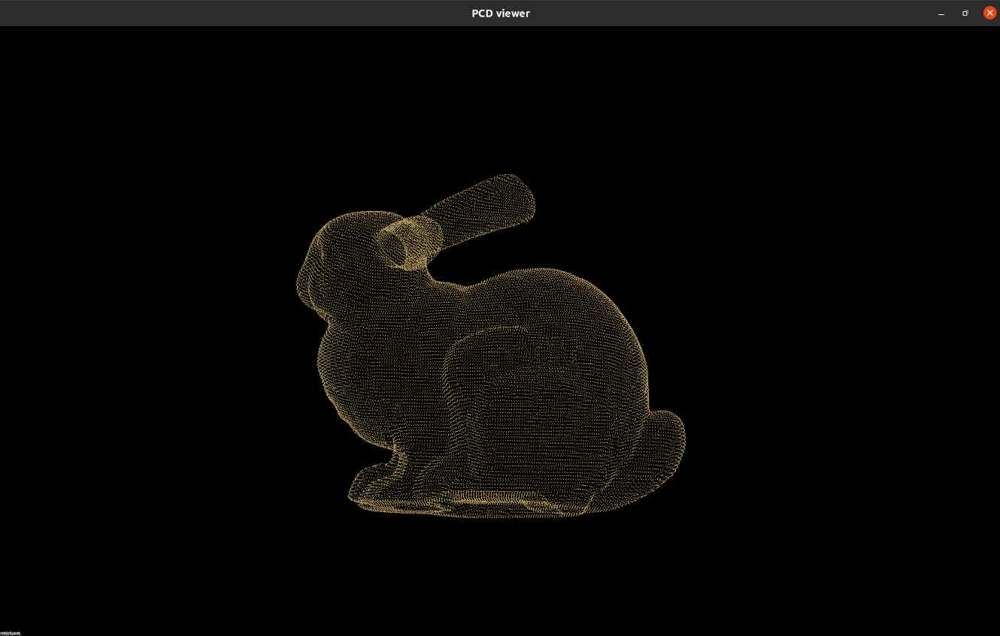
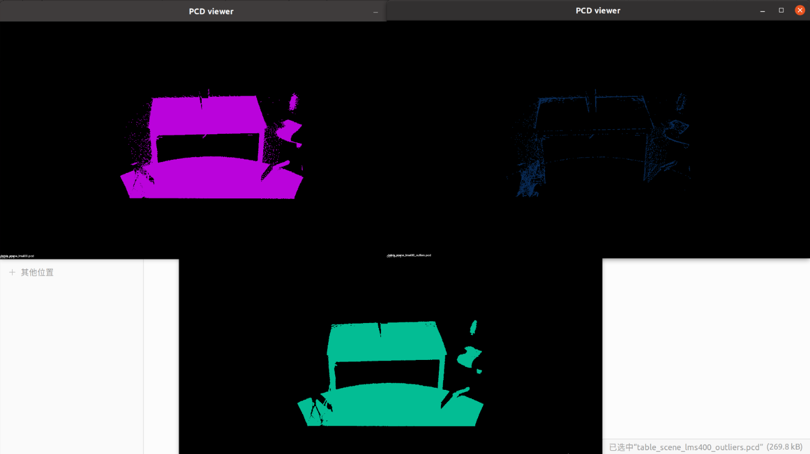
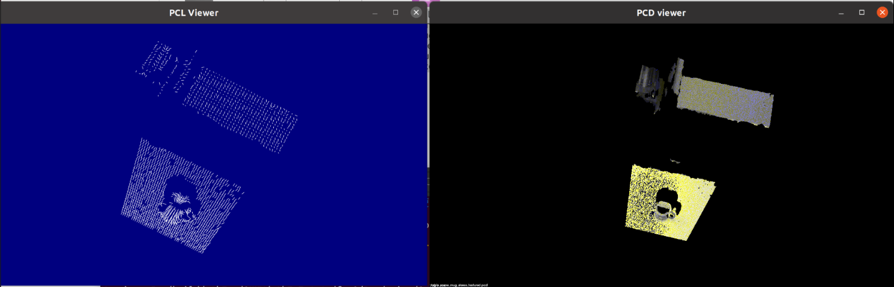
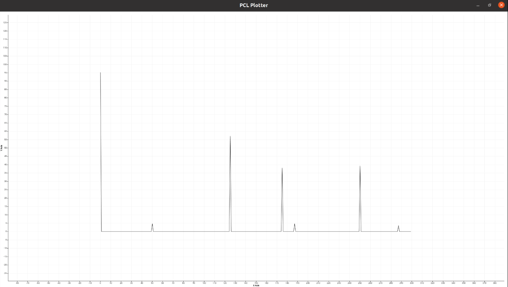
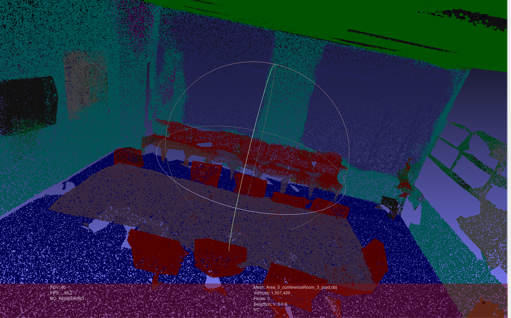

## LiDAR 3D point cloud reconstrunction

### Intro

In this project, I focus on building 3D point cloud reconstrunction.

**CMake**
```C++
//go to build folder, open terminal
cmake ..
make
//Run project name
./ xx
//Now you can see some details in your terminal
```

### 1. Viewer

#### 1.1 PCL_viewer
Run `pcl_viewer name.pcd`  in terminal, you can see a 3D point window.



⚠️ Note: You may meet some problem like:
`pcl_viewer: ../../src/xcb_io.c:260: poll_for_event: Assertion !xcb_xlib_threads_sequence_lost' failed.
已放弃 (核心已转储)
` Run command again can solve it!

##### 1.2 .las -> .pcdtrans

使用脚本`transform.py`读取las格式文件，并将其转化为pcd格式文件。


### 2. Filter

#### 2.1 SoR

```
Cloud before filtering: 
header: seq: 0 stamp: 0 frame_id: 

points[]: 460400
width: 460400
height: 1
is_dense: 1
sensor origin (xyz): [0, 0, 0] / orientation (xyzw): [0, 0, 0, 1]

Cloud after filtering: 
header: seq: 0 stamp: 0 frame_id: 

points[]: 451410
width: 451410
height: 1
is_dense: 1
sensor origin (xyz): [0, 0, 0] / orientation (xyzw): [0, 0, 0, 1]

```

如图所示，展现的是原始点云、滤出的噪声点、滤波后的点云



### 3. Feature Extraction

#### 3.1 Normal estimation

如图所示为法向量提取后的每个点云半径内的法向量


#### 3.2 Normal estimation(Integral images )



#### 3.3 PFH

提取的PFH直方图分布
运行PFH1：phf feature size : 3400




### 4. PointCloud Segmentation

#### 4.1 点云数据标注

使用CloudCompare：

教程：https://blog.csdn.net/weixin_44638846/article/details/140406751

⚠️ 可能会出现报错：CMake Error at libs/CCAppCommon/CMakeLists.txt:3 (add_library):
Cannot find source file:
/root/download/CloudCompare/libs/CCAppCommon/QDarkStyleSheet/qdarkstyle/dark/darkstyle.qrc

可以git submodule update --init --recursive
在终端运行这句，然后重新构建编译

提取txt文件：https://blog.csdn.net/weixin_44603934/article/details/123591370?spm=1001.2014.3001.5501

对与第四列的数据进行剔除

```python
# -*- coding:utf-8 -*-
import os
filePath = 'D:\\点云数据处理小组\\pointnet-my\\data\\shapenetcore_partanno_segmentation_benchmark_v0_normal\\03797390'
for i,j,k in os.walk(filePath):
    for name in  k:
        list1 = []
        for line in open(filePath+name):
            a = line.split()
            #print(a)
            b = a[0:6]
            #print(b)
            a1 =float(a[0])
            a2 =float(a[1])
            a3 =float(a[2])
            #print(a1)
            if(a1==0 and a2==0 and a3==0):
                continue
            list1.append(b[0:6])
        with open(filePath+name, 'w+') as file:
            for i in list1:
                file.write(str(i[0]))
                file.write(' '+str(i[1]))
                file.write(' ' + str(i[2]))
                file.write(' ' + str(i[3]))
                file.write(' ' + str(i[4]))
                if(i!=list[-1]):
                    file.write('\n')
        file.close()
```


#### 4.2 PointNet++

* Datasets:
https://github.com/open-mmlab/mmdetection3d/tree/1.0/data/s3dis

* Tips：
训练时出现显卡内存不足的情况，可以减少batch size，并禁用多线程

* 处理结果：


* 训练自己的数据:
https://blog.csdn.net/weixin_44603934/article/details/123589948


#### 4.3 PointTransformer

* 复现：


train:
sh scripts/train.sh -p python -g 1 -d s3dis -c semseg-pt-v3m1-1-rpe -n semseg-pt-v3m1-1-rpe
