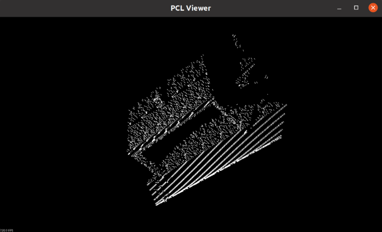

## LiDAR 3D point cloud reconstrunction

### Intro

In this project, I focus on building 3D point cloud reconstrunction.

**CMake**
```C++
//go to build folder, open terminal
cmake ..
make
//Run project name
./ xx
//Now you can see some details in your terminal
```

### 1. Viewer

Run `pcl_viewer name.pcd`  in terminal, you can see a 3D point window.


⚠️ Note: You may meet some problem like:
`pcl_viewer: ../../src/xcb_io.c:260: poll_for_event: Assertion !xcb_xlib_threads_sequence_lost' failed.
已放弃 (核心已转储)
` Run command again can solve it!

### 2. Filter

#### 2.1 SoR

```
Cloud before filtering: 
header: seq: 0 stamp: 0 frame_id: 

points[]: 460400
width: 460400
height: 1
is_dense: 1
sensor origin (xyz): [0, 0, 0] / orientation (xyzw): [0, 0, 0, 1]

Cloud after filtering: 
header: seq: 0 stamp: 0 frame_id: 

points[]: 451410
width: 451410
height: 1
is_dense: 1
sensor origin (xyz): [0, 0, 0] / orientation (xyzw): [0, 0, 0, 1]

```

如图所示，展现的是原始点云、滤出的噪声点、滤波后的点云


### 3. Feature Extraction

#### 3.1 Normal estimation

如图所示为法向量提取后的每个点云半径内的法向量


#### 3.2 Normal estimation(Integral images )


#### 3.3 PFH

提取的PFH直方图分布
运行PFH1：phf feature size : 3400


### 4. PointCloud Segmentation

#### 4.1 PointNet++

##### 4.1.1 Dataet

https://github.com/open-mmlab/mmdetection3d/tree/1.0/data/s3dis